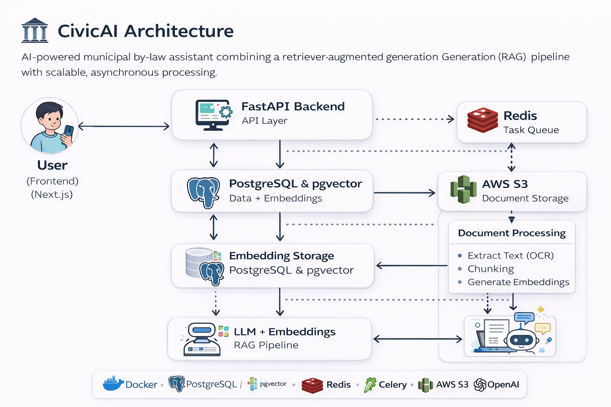

# 🏛️ CivicAI — AI-Powered Municipal By-Law Assistant

CivicAI is a full-stack AI system that allows users to ask natural language questions about municipal by-laws and receive structured, citation-backed answers.

It combines **Retrieval-Augmented Generation (RAG)**, **vector search**, and a **scalable background processing pipeline** to deliver accurate and explainable responses.

---

## 🚀 Live Demo

- 🌐 Frontend: https://civicai.rahulawale.com   

---

## ✨ Features

### 🔍 Public Chat Interface
- Ask natural language questions about city by-laws  
- AI-generated answers with **source citations (page-level)**  
- Clean, user-friendly UI  

### 🛠️ Admin Dashboard
- Manage cities and documents  
- Upload and track by-law PDFs  
- Monitor processing jobs and statuses  

### ⚡ Asynchronous Processing System
- Background job queue using **Redis + Celery**  
- Job lifecycle:  
  `queued → running → completed / failed`  
- Scalable processing for large document sets  

### 📄 Document Intelligence Pipeline
- PDF ingestion (with OCR fallback support)  
- Chunking and embedding  
- Vector storage using **pgvector (PostgreSQL)**  
- Retrieval for RAG-based answering  

---

## 🧠 System Architecture



---

## 🏗️ Tech Stack

### Frontend
- Next.js (App Router)
- TypeScript
- Tailwind CSS
- Vercel (deployment)

### Backend
- FastAPI
- SQLAlchemy
- PostgreSQL + pgvector

### AI / ML
- OpenAI Embeddings + LLM
- Retrieval-Augmented Generation (RAG)
- OCR fallback (for scanned PDFs)

### Infrastructure
- Docker (containerized services)
- Redis (queue)
- Celery (workers)
- AWS EC2 (backend hosting)
- AWS S3 (document storage)
- Nginx (reverse proxy)
- Cloudflare (DNS + SSL)

---

## 🔄 Processing Workflow

1. Admin uploads a PDF document  
2. Document is stored in S3 and registered in the database  
3. A processing job is created (`queued`)  
4. Job is pushed to Redis queue  
5. Celery worker processes:
   - Extract text (OCR if needed)
   - Chunk document
   - Generate embeddings
   - Store in pgvector  
6. Document becomes searchable via chat  

---

## 📊 Job Status Lifecycle

### ProcessingJob
- `queued`
- `running`
- `completed`
- `failed`

### Document
- `uploaded`
- `processing`
- `processed`
- `failed`

---

## 🔐 Security & Deployment

- HTTPS via **Cloudflare + Nginx + Certbot**
- Reverse proxy architecture
- Environment-based configuration
- Secure API communication between frontend and backend

---

## 🧪 Local Setup

```bash
git clone https://github.com/your-username/civicai.git
cd civicai
docker compose up --build
```

Then open:
- http://localhost:8000/docs

---

## 📌 Key Highlights

- Built a **production-style async pipeline** using Redis + Celery  
- Designed a full **RAG system with vector search**  
- Implemented **admin-controlled document ingestion + processing**  
- Deployed using **Docker + AWS + Nginx + Cloudflare**  
- Created a **complete full-stack AI application**

---

## 🧭 Future Improvements

- Multi-document upload  
- Retry failed jobs  
- Real-time progress tracking  
- Streaming responses in chat  
- Role-based access control  

---

## 👨‍💻 Author

**Rahul Awale**  
AI & Data Science | AI Engineer  

